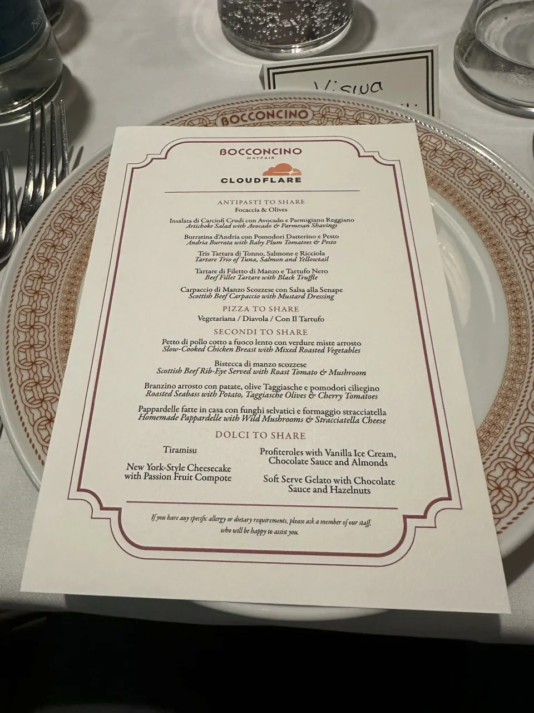
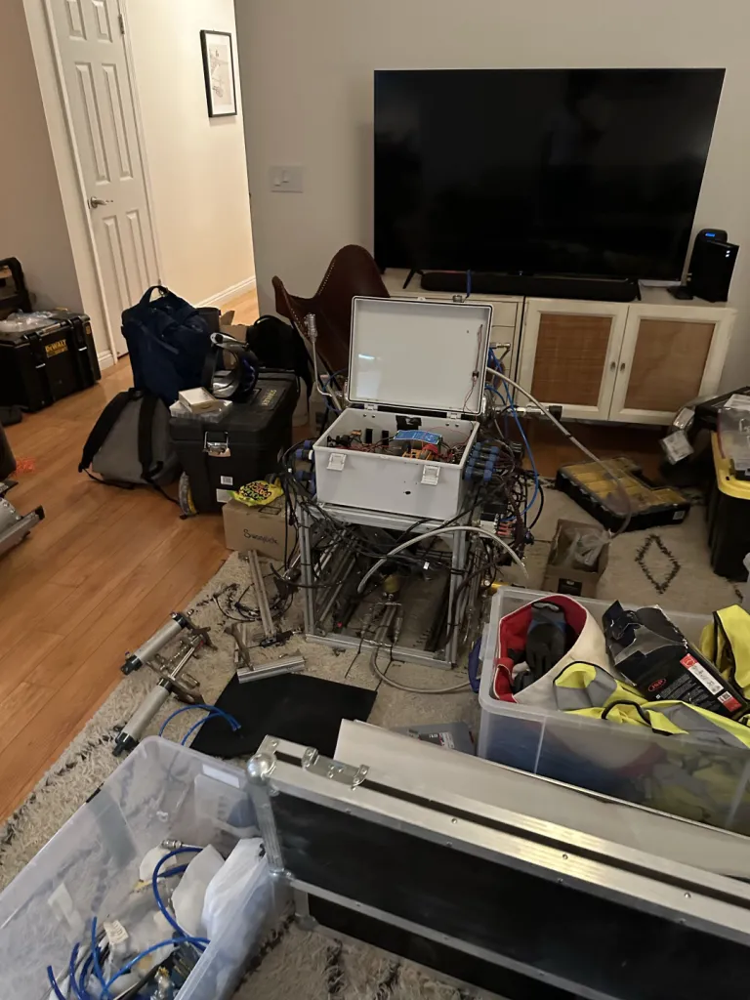

This summer, I was lucky enough to get the chance to intern for the [Cloudflare Agents](https://agents.cloudflare.com) team. I was able to work on some really awesome stuff, from self-building apps with the Agents SDK, to building a completely new Agents SDK (and more!) in Python. The last 3 months have been me really experimenting with Python workers and pushing its boundaries.

# The Agents Team

I think a good place to start is to talk about the Agents team. I had heard of the Agents team at Cloudflare on X long before I even interviewed for the team, through [Kate Reznykova](https://x.com/whoiskatrin) and [Sunil Pai](https://x.com/threepointone)'s posts. Pretty difficult to miss them if you're on tech twitter at all.

My impression of the team pre-internship was, apart from being one of the cooler teams at Cloudflare, was a team doing some of the most important work at the company - AI Agents continue to make up more and more of the internet so its becoming increasingly important to work with them correctly.

You can imagine my surprise and excitement when I was matched to the Agents team during the hiring process. I was even more hyped when there were discussions of a potential Python Agents SDK in my interview.

Joining the Agents team was even crazier - I saw first hand how fast everyone shipped. There were new cool PRs almost daily. The team themselves were all super interesting, all coming from genuinely interesting backgrounds, not just your average big tech employees.

Two highlights were the Cloudflare Intern Lunch and the Agents Team lunch (Sunil knows the craziest spots).

<div class="grid grid-cols-1 md:grid-cols-2 gap-4 items-center">



<blockquote class="twitter-tweet"><p lang="en" dir="ltr">wrapping up a perfect trip with lunch with the greatest team on the planet (my team) with koba and decadent hot chocolate <br><br>also spotted a bacon bap on the tube platform, not sure what omen that signifies <a href="https://t.co/HMA2hka5eS">pic.twitter.com/HMA2hka5eS</a></p>&mdash; sunil pai (@threepointone) <a href="https://x.com/threepointone/status/2080290581004083561?ref_src=twsrc%5Etfw">July 23, 2026</a></blockquote> <script async src="https://platform.x.com/widgets.js" charset="utf-8"></script>

</div>

# Python & I

The first two weeks at Cloudflare were spent building with the Agents SDK, understanding what was possible with it and looping in the ecosystem around it like the late [Sandbox SDK](https://www.cloudflare.com/products/sandboxes/) and the new [Computer SDK](https://github.com/cloudflare/computer). I put together a self-building notes app that started off as a base obsidian clone, giving users an agentic "buddy" that would allow users to prompt their notes for a UI that fit them using Facets and Dynamic Workers under the hood.

The idea of a Python Agents SDK was still lingering though and the idea of working to push for a better Python Workers eco-system was interesting. So after 2 weeks of experiments and demos, I started work on it.

Despite our access to free tokens, I spent the first day or two hand-coding an implementation of Sunil Pai's PartyServer and the Agents SDK's core `Agent` class in Python. In hindsight, I would've potentially benefitted from a different approach now that `PartyServer`'s been ripped out of the Agents SDK, however, it gave me a strong starting point - I had a proven architecture to go off of and one that agents were already familiar with from the TypeScript SDK (important soon!).

```python
from typing import Any

from workers import Response, Request, WorkerEntrypoint
from agents import Agent, rpc_callable

class MyAgent(Agent):
  def initial_state(self) -> dict[str, Any]:
    return {"count": 0}

  @rpc_callable
  def increment(self, amount: int = 1):
    # this can be async too :)
    self.state["count"] += amount
    self.set_state(self.state)

    return self.state["count"]

class Default(WorkerEntrypoint):
  async def fetch(self, request: Request) -> Response:
    return await route_agent_request(request, self.env) or Response(
      "Not Found", status=404
    )

# more of a side note
# I think this syntax would be great, entry could just be a marker decorator of some sort
# or even construct the WorkerEntrypoint class under the hood

from workers import entry, Request, Env

@entry
async def fetch(request: Request, env: Env) -> Response:
  return await route_agent_request(request, env) or Response("Not Found", status=404)
```

This was a good start to prove that a Python Agents SDK was possible. My goal was to keep the frontend client from the TypeScript Agents SDK compatible and not divert completely from an already familiar API. Though, I still had ideas for some neat Python-only syntax.

# Jarred'ing it

To get anywhere with a Python Agents SDK, you need to use *the power of agents*. Jarred Sumner's infamous blog post on [rewriting Bun in Rust](https://bun.com/blog/bun-in-rust) was a sort of guide I used to create an initial port using agents. Crucially, it was a guide, I still forked off into my own methods. The goal was to have Agents spearhead the port, but this didn't mean there was no human understanding or intervention.

I think a good analogy is like trying to translate a book written in Mandarin Chinese to English with no understanding of Mandarin or the text at hand. Sure you can produce a literal translation with modern tools, but you'll lose out on context and deeper meaning and end up with a super literal, nonsensical translation.

Porting a piece of software with agents with the instruction "make me a python version, make no mistakes" can go terribly wrong. I did try this out of curiosity (common sense obviously told me BAD IDEA but one has to *research* sometimes). The results were filled with either dry line-by-line literal translations of LOC, or a sloppy attempt at creating a genuine port of a feature. Some "sloppiness" I often saw:

- Extremely "forced" functions/classes. The code worked, but it was almost like it trial-and-errored just to get it to work, with no regard for code cleanliness or maintainability.
- Highly coupled code. A lot of the code agents given little guidance wrote created large amounts of interdepdenence. This ties back to the "it just works" mentality.

## The .design/ method

Jarred spent 3 hours talking to Claude and produced a huge `PORTING.md` to begin porting all in one go. I decided to take a layered approach, starting with the core `Agent` primitives first such as RPC and the actual agents wire protocol, before moving onto features such as MCP, Tasks or Workflows.

I had a `.design/` folder, full of markdown files co-authored by agents and I, for each feature I was working on. I'd begin by writing a portion of the doc myself, describing what I thought was a good approach for tackling some feature. This initial human pass often included: proposed Python API, structure of internal code, how to hook into existing code, patterns to avoid and crucially, what it means for the feature to be "complete", whether that meant unit tests passing or a full demo app smoke test being run (agents love to use the word "smoke-test" so much for some reason - I've probably run hundreds of smoke tests while at Cloudflare).

The initial human pass helped lay the ground work for agents and set out rules to avoid sloppy code. The human pass was often no more than an A4 page long approximately. I would then point my agent towards this doc, and kick off a detailed discussion with the agent, answering any questions it had or anything in my guidelines it found wrong or restrictive. These discussions often became technical, delving into pros and cons of multiple approaches.

My agent would then synthesize our discussion into a `.design/<feature_name>.md` file, effectively an implementation plan and a set of guidelines. This was often good enough for my agent to port a feature.

In today's age, some people might see this as extensive, and to some extent it is. There were definitely cases where I gave the agent a brief description and told it to "just do it". I regret *some* those cases. The small number of those cases led to a lot of code becoming entangled in slop. The models are getting better, but they're not at a point where I'm comfortable letting them go on their own yet, not on projects of this scale at least (though Opus 5.5 has impressed me).

# A brief rocketry break

I took a brief break from my internship, to go with a rocketry team I'm part of (the [Karman Space Programme](https://karmanspace.co.uk)) to the Friends of Amateur Rocketry launch site in Los Angeles to attempt to launch our latest rocket, VEGA.Unfortunately, we weren't able to launch, but we were able to complete a cold flow and partially successful static fire.

<div class="flex flex-wrap justify-center gap-2 [&>p]:m-0 [&>p]:basis-[calc((100%-0.5rem)/2)] md:[&>p]:basis-[calc((100%-1rem)/3)] [&_img]:rounded-lg">




</div>


# Crosswind

I think a lot has been left unexplored in Python Workers during my internship and a lot can be improved in my port of the Agents SDK. Python Workers have huge potential, but I feel the DX side of them has been partially neglected, which makes sense and the right thing to do. The focus on improving the Python Workers runtime by the team is awesome.

I've started a project called [Crosswind](https://crosswind.viswa.space). It's a collection of Python SDKs I'm putting together to improve the DX for Cloudflare Python Workers. I've already put together a Containers SDK, I plan on improving my Agents SDK that I wrote at Cloudflare too (yes I have permission). I have more ideas such as a thin router or a thin wrapper around the `workers-runtime-sdk` to improve DX (from syntax to typing stubs).

I enjoy Python (and Rust) and think Cloudflare Python Workers have MASSIVE potential and I'd like to see them become as mainstream as the Rust and TS workers too.

# What's next for me?

Taking a year out from university is what's next for me (due to some personal reasons). I'll be focusing on family, but also looking for some work and continuing to work on some cool stuff like Crosswind in the meantime. I'll also be continuing to explore FPGA technology, participating in the rocketry team and continuing to explore agents!